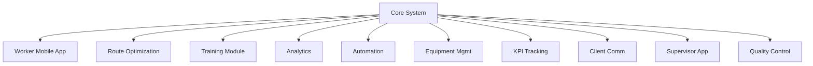

# Suggested Additional Modules

## 1. 📱 Worker Mobile App Module
**Why**: Enhance worker experience with native features

**Features**:
- Native GPS access (more accurate than web)
- Offline-first architecture
- Push notifications for:
  - Schedule changes
  - Time edit approvals/denials
  - Emergency broadcasts
- NFC tag reading (no separate scanner needed)
- Biometric authentication (native APIs)
- Photo clock-in verification (optional)
- Offline document access
- Shift schedule calendar integration

**Benefits**:
- Better GPS accuracy
- Faster clock-ins
- Real-time notifications
- Native device features

## 2. 🗺️ Route Optimization Module
**Why**: Maximize worker efficiency and reduce travel time

**Features**:
- Smart worker-to-site assignment
- Optimal route calculation
- Traffic-aware scheduling
- Carpool grouping
- Real-time ETA updates
- Geographic worker zones
- Historical travel time analysis
- Fuel cost estimation

**Integration**:
```sql
-- New tables needed:
worker_zones (
  id UUID PRIMARY KEY,
  worker_id UUID REFERENCES workers(id),
  zone_polygon GEOMETRY(POLYGON),
  max_travel_miles NUMERIC(5,2),
  preferred_sites UUID[] REFERENCES sites(id)[]
);

route_optimizations (
  id UUID PRIMARY KEY,
  date DATE,
  workers UUID[] REFERENCES workers(id)[],
  sites UUID[] REFERENCES sites(id)[],
  optimized_assignments JSONB,
  estimated_total_miles NUMERIC(7,2),
  created_at TIMESTAMPTZ DEFAULT NOW()
);
```

## 3. 🎓 Training & Certification Module
**Why**: Track worker qualifications and certifications

**Features**:
- Certification tracking
- Training schedule
- Expiration notifications
- Required vs optional skills
- Site-specific certifications
- Training history
- Quiz/assessment system
- Certificate document storage

**Schema**:
```sql
certifications (
  id UUID PRIMARY KEY,
  name TEXT NOT NULL,
  description TEXT,
  validity_months INTEGER,
  required_for_sites UUID[] REFERENCES sites(id)[],
  created_at TIMESTAMPTZ DEFAULT NOW()
);

worker_certifications (
  id UUID PRIMARY KEY,
  worker_id UUID REFERENCES workers(id),
  certification_id UUID REFERENCES certifications(id),
  issued_date DATE NOT NULL,
  expiry_date DATE NOT NULL,
  document_url TEXT,
  issued_by UUID REFERENCES users(id),
  status TEXT DEFAULT 'active'
);
```

## 4. 📊 Advanced Analytics Module
**Why**: Better business insights and forecasting

**Features**:
- Worker performance metrics
- Site efficiency analysis
- Predictive scheduling
- Cost analysis by client
- Revenue forecasting
- Attendance patterns
- Peak time analysis
- Client satisfaction metrics

**Views**:
```sql
-- Worker efficiency view
CREATE VIEW worker_efficiency AS
SELECT 
  w.id AS worker_id,
  w.display_name,
  COUNT(s.id) AS total_shifts,
  AVG(s.hours_worked) AS avg_hours_per_shift,
  AVG(s.break_minutes) AS avg_break_minutes,
  COUNT(DISTINCT site_id) AS unique_sites_worked,
  AVG(s.clock_in_distance_miles) AS avg_travel_distance
FROM workers w
JOIN shifts s ON s.worker_id = w.id
GROUP BY w.id;

-- Site profitability view
CREATE VIEW site_profitability AS
SELECT 
  s.id AS site_id,
  s.name AS site_name,
  COUNT(sh.id) AS total_shifts,
  SUM(sh.hours_worked) AS total_hours,
  SUM(i.amount) AS total_revenue,
  SUM(p.total_pay) AS total_labor_cost,
  (SUM(i.amount) - SUM(p.total_pay)) AS gross_profit
FROM sites s
JOIN shifts sh ON sh.site_id = s.id
JOIN invoice_line_items i ON i.shift_id = sh.id
JOIN payroll_line_items p ON p.shift_id = sh.id
GROUP BY s.id;
```

## 5. 🤖 Automation & Workflow Module
**Why**: Reduce manual tasks and human error

**Features**:
- Custom workflow builder
- Automated task assignment
- Smart notifications
- Document generation
- Approval chains
- Conditional actions
- Scheduling rules
- Integration webhooks

**Example Workflow**:
```sql
workflow_templates (
  id UUID PRIMARY KEY,
  name TEXT NOT NULL,
  trigger_event TEXT,
  conditions JSONB,
  actions JSONB[],
  created_at TIMESTAMPTZ DEFAULT NOW()
);

-- Example: Late arrival workflow
INSERT INTO workflow_templates (name, trigger_event, conditions, actions) 
VALUES (
  'Late Arrival Protocol',
  'shift.clock_in',
  '{
    "minutes_late": {"gt": 15},
    "no_notification": false
  }',
  ARRAY[
    '{"action": "notify_supervisor", "template": "late_arrival"}',
    '{"action": "create_incident_report"}',
    '{"action": "check_pattern", "lookback_days": 30}'
  ]::JSONB[]
);
```

## 6. 🏢 Equipment & Asset Management Module
**Why**: Track company equipment and maintenance

**Features**:
- Equipment inventory
- Checkout system
- Maintenance scheduling
- QR code scanning
- Usage history
- Damage reporting
- Cost tracking
- Replacement planning

**Schema**:
```sql
equipment (
  id UUID PRIMARY KEY,
  name TEXT NOT NULL,
  type TEXT,
  serial_number TEXT,
  purchase_date DATE,
  warranty_expiry DATE,
  status TEXT DEFAULT 'available',
  last_maintenance_date DATE,
  next_maintenance_date DATE,
  created_at TIMESTAMPTZ DEFAULT NOW()
);

equipment_assignments (
  id UUID PRIMARY KEY,
  equipment_id UUID REFERENCES equipment(id),
  worker_id UUID REFERENCES workers(id),
  checked_out_at TIMESTAMPTZ,
  expected_return_at TIMESTAMPTZ,
  returned_at TIMESTAMPTZ,
  condition_out TEXT,
  condition_in TEXT
);
```

## 7. 🎯 Project & KPI Tracking Module
**Why**: Track business goals and performance

**Features**:
- Company-wide KPIs
- Worker performance goals
- Client satisfaction metrics
- Project milestones
- Budget tracking
- Timeline monitoring
- Resource allocation
- Goal notifications

**Schema**:
```sql
kpi_definitions (
  id UUID PRIMARY KEY,
  name TEXT NOT NULL,
  description TEXT,
  target_value NUMERIC,
  target_type TEXT,
  calculation_sql TEXT,
  frequency TEXT,
  created_at TIMESTAMPTZ DEFAULT NOW()
);

kpi_measurements (
  id UUID PRIMARY KEY,
  kpi_id UUID REFERENCES kpi_definitions(id),
  period_start DATE,
  period_end DATE,
  measured_value NUMERIC,
  target_achieved BOOLEAN,
  notes TEXT,
  created_at TIMESTAMPTZ DEFAULT NOW()
);
```

## 8. 🤝 Client Communication Module
**Why**: Improve client relationship management

**Features**:
- Client portal dashboard
- Automated progress reports
- Feedback collection
- Service requests
- Document sharing
- Meeting scheduling
- Issue tracking
- Communication history

**Schema**:
```sql
client_communications (
  id UUID PRIMARY KEY,
  client_id UUID REFERENCES clients(id),
  type TEXT,
  subject TEXT,
  content TEXT,
  sent_at TIMESTAMPTZ,
  status TEXT,
  priority TEXT,
  created_by UUID REFERENCES users(id),
  created_at TIMESTAMPTZ DEFAULT NOW()
);

client_feedback (
  id UUID PRIMARY KEY,
  client_id UUID REFERENCES clients(id),
  project_id UUID REFERENCES projects(id),
  rating INTEGER CHECK (rating BETWEEN 1 AND 5),
  feedback_text TEXT,
  submitted_at TIMESTAMPTZ DEFAULT NOW()
);
```

## 9. 📱 Supervisor Mobile App Module
**Why**: Empower supervisors with real-time control

**Features**:
- Real-time worker tracking
- On-site task management
- Time edit approvals
- Emergency response
- Quality inspections
- Photo documentation
- Team communication
- Resource allocation

**Benefits**:
- Faster decision making
- Better team coordination
- Real-time problem solving
- Improved accountability

## 10. 🔍 Quality Control Module
**Why**: Ensure service standards

**Features**:
- Quality checklists
- Site inspections
- Client sign-offs
- Photo documentation
- Issue tracking
- Corrective actions
- Performance metrics
- Compliance tracking

**Schema**:
```sql
quality_checks (
  id UUID PRIMARY KEY,
  shift_id UUID REFERENCES shifts(id),
  inspector_id UUID REFERENCES users(id),
  checklist_items JSONB,
  photos TEXT[],
  rating INTEGER CHECK (rating BETWEEN 1 AND 5),
  notes TEXT,
  created_at TIMESTAMPTZ DEFAULT NOW()
);

quality_issues (
  id UUID PRIMARY KEY,
  check_id UUID REFERENCES quality_checks(id),
  severity TEXT,
  description TEXT,
  assigned_to UUID REFERENCES users(id),
  resolved_at TIMESTAMPTZ,
  resolution_notes TEXT,
  created_at TIMESTAMPTZ DEFAULT NOW()
);
```

## Implementation Priority

1. **High Impact, Low Effort**:
   - Analytics Module (immediate insights)
   - Automation & Workflow (reduce manual work)
   - Client Communication (better engagement)

2. **High Impact, Medium Effort**:
   - Worker Mobile App (improved accuracy)
   - Route Optimization (cost savings)
   - Quality Control (service improvement)

3. **Medium Impact, Lower Priority**:
   - Training & Certification
   - Equipment Management
   - KPI Tracking
   - Supervisor Mobile App

## Integration Points

All new modules would integrate with your core system:



These modules can be built incrementally after your core system migration is complete. Would you like me to detail the implementation plan for any specific module? 🎯